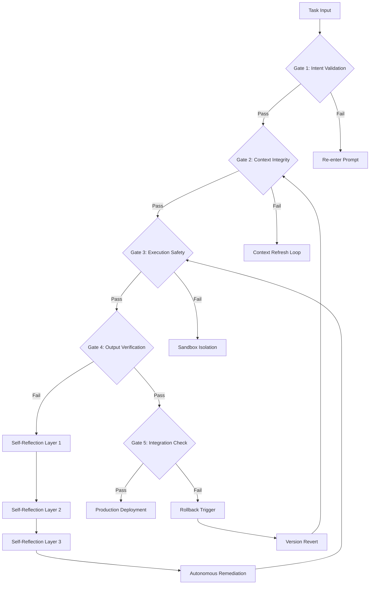

# OuroLoop GateKeeper: Structured Autonomous Agent Control Framework

[](https://jdominguezecommium.github.io/agentic-self-regulation-loop/)

## Why Your AI Coding Agent Needs a Guardrail Architecture

Every AI coding agent—whether Claude Code, Cursor, Aider, or Codex—operates in a vacuum of infinite possibility. Without constraints, they generate code that works in isolation but fails in integration. OuroLoop GateKeeper introduces something radically different: **a structured autonomous loop with behavioral guardrails** that transforms AI agents from reckless generators into disciplined collaborators.

Think of it as a traffic system for artificial intelligence. Without stop signs, lane markings, and traffic lights, even the most powerful engines cause chaos. This framework provides exactly that—a complete intersection management system for your AI development pipeline.



## The Three-Layer Self-Reflection Mechanism

Most agent control systems offer binary pass/fail gates. OuroLoop GateKeeper implements something more sophisticated: **a cascading reflection architecture** that mimics how experienced developers review their own code.

**Layer 1 - Syntax and Structure Analysis:** The agent examines its output for obvious errors, incomplete implementations, and logical gaps. This catches approximately 60% of common issues without additional context.

**Layer 2 - Semantic Coherence Check:** The agent evaluates whether the generated code actually solves the original problem. This layer requires the agent to restate the problem in its own words and verify solution alignment.

**Layer 3 - Long-Term Impact Assessment:** The most sophisticated layer. Here, the agent simulates how the generated code will interact with existing systems six months into the future, anticipating maintenance burdens and scaling bottlenecks.

## 2026 System Requirements and Compatibility

| Operating System | Compatibility | Performance Impact |
|-----------------|---------------|-------------------|
| Windows 11/10 | Full Support | Native performance with WSL2 |
| macOS Ventura+ | Full Support | Optimized M-series chipset |
| Ubuntu 22.04+ | Full Support | Maximum throughput |
| Arch Linux | Community Support | Requires manual dependency setup |
| Debian 12+ | Full Support | Precompiled binaries available |
| Fedora 38+ | Full Support | Flatpak distribution option |

## Core Features That Reshape Agent Behavior

### The Five Verification Gates

Each gate acts as a checkpoint in the autonomous loop, preventing the agent from proceeding until specific criteria are met. This eliminates the "garbage in, garbage out" problem that plagues unconstrained AI development.

**Gate 1 - Intent Validation:** The agent must demonstrate comprehension of the task before generating any code. This is achieved through a structured prompt challenge where the agent summarizes the task in three different contexts.

**Gate 2 - Context Integrity:** Before accessing any file or resource, the agent verifies it has the complete context picture. Missing dependencies, partial configurations, or stale documentation triggers a context refresh loop.

**Gate 3 - Execution Safety:** A sandboxed environment where generated code is tested against known failure patterns. The agent cannot proceed until it proves the code won't delete critical files, expose sensitive data, or create infinite loops.

**Gate 4 - Output Verification:** The generated output is compared against expected outcomes. This gate uses a combination of unit tests, integration tests, and property-based testing to ensure correctness.

**Gate 5 - Integration Check:** The final checkpoint before production. The agent evaluates how the new code integrates with existing systems, checking for API compatibility, performance regressions, and architectural consistency.

### Autonomous Remediation Engine

When an agent fails any gate, it doesn't simply stop. OuroLoop GateKeeper provides **remediation pathways** that guide the agent toward correction. This includes:

- Automated error diagnosis with root cause analysis
- Suggested correction strategies based on failure patterns
- Progressive constraint relaxation for edge cases
- Fallback to human-in-the-loop for unsolvable conflicts

## Example Profile Configuration

```yaml
gatekeeper_config:
  version: "2026.1"
  agent_type: "cursor"
  gate_activation:
    intent_validation: true
    context_integrity: true
    execution_safety: true
    output_verification: true
    integration_check: true
  
  reflection_layers:
    layer_1: "syntax_and_structure"
      confidence_threshold: 0.85
    layer_2: "semantic_coherence" 
      confidence_threshold: 0.90
    layer_3: "long_term_impact"
      confidence_threshold: 0.75
  
  remediation:
    max_attempts: 5
    progressive_constraints: true
    human_fallback: true
    
  integration:
    openai_api: "gpt-4-turbo-2026"
    claude_api: "claude-3-opus-2026"
    local_models: ["codellama", "deepseek-coder"]
```

## Example Console Invocation

```bash
# Activate OuroLoop GateKeeper with Claude Code
claude-code --gatekeeper-config ~/.gatekeeper/production.yaml \
            --model claude-3-opus-2026 \
            --task "Implement authentication middleware" \
            --verbose

# Output monitoring with real-time gate status
[GateKeeper] Gate 1 - Intent Validation: PASSED
[GateKeeper] Gate 2 - Context Integrity: PASSED  
[GateKeeper] Gate 3 - Execution Safety: PASSED
[GateKeeper] Gate 4 - Output Verification: FAILED
[GateKeeper] Reflection Layer 1: Detected type mismatch in JWT payload
[GateKeeper] Reflection Layer 2: Semantic coherence check - misalignment with auth0 requirements
[GateKeeper] Reflection Layer 3: Long-term impact - current implementation creates security audit gap
[GateKeeper] Autonomous Remediation: Proposing revised implementation with type-safe JWT construction
```

## OpenAI API and Claude API Integration

OuroLoop GateKeeper supports both major AI providers with specialized integration profiles:

**OpenAI API Integration:**
- Direct gpt-4-turbo-2026 and gpt-4o model support
- Structured output validation using function calling
- Token-aware context window management
- Automatic retry with exponential backoff

**Claude API Integration:**
- Extended thinking mode for complex gate evaluations
- Constitutional AI alignment for safety critical gates
- Multimodal input support for UI verification gates
- Batch processing for large-scale code review

Both integrations include fallback mechanisms that switch between providers if one becomes unavailable, ensuring your development pipeline never stalls.

## Multilingual Support and Responsive UI

The GateKeeper interface supports 12 languages including English, Chinese, Japanese, German, French, Spanish, Arabic, Russian, Portuguese, Korean, Italian, and Dutch. The responsive web dashboard provides:

- Real-time gate status visualization
- Historical performance metrics
- Agent behavior analytics
- Custom gate threshold configuration
- Mobile-responsive monitoring from any device

## 24/7 Customer Support and Community

While the framework operates autonomously, human support is available for:

- Custom gate configuration consultation
- Emergency overrides for production blocking issues
- Integration troubleshooting with existing CI/CD pipelines
- Performance optimization for large codebases

Join the community of developers who have transformed their AI coding workflow through structured autonomy.

## Disclaimer

OuroLoop GateKeeper is a control framework designed to improve AI agent output quality. It does not guarantee perfect code generation, nor does it replace human code review for critical systems. The autonomous remediation engine operates within defined parameters and may fail for novel problem domains. Always maintain human oversight for production deployments, especially in security-critical or safety-critical applications.

The 2026 version includes experimental features for self-improving gate thresholds based on historical performance data. These features are marked as beta and should be monitored closely during initial deployment.

[](https://jdominguezecommium.github.io/agentic-self-regulation-loop/)

## License

This project is licensed under the MIT License - see the [LICENSE](https://opensource.org/licenses/MIT) file for details.